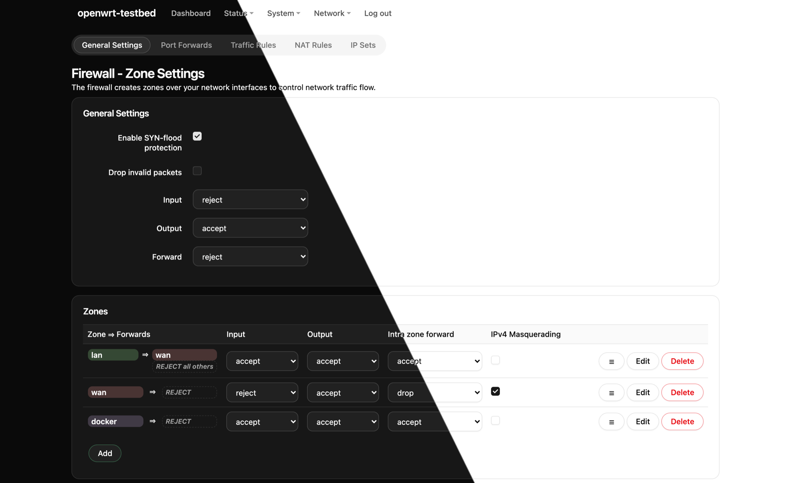

# luci-theme-shadcnui

A theme for **LuCI**, the OpenWrt web interface, in the style of
[shadcn/ui](https://ui.shadcn.com): cards, a segmented tab strip, bordered data
tables that scroll themselves when they do not fit, a full-screen menu sheet on a
phone and an `oklch` palette. Light and dark, and every LuCI page keeps working —
nothing about the markup or the workflow changes, only how it looks.



<p align="center">
  <a href="docs/screenshots.md"><b>More screenshots →</b></a><br>
  <sub>the dashboard, initscripts, interfaces, a modal, the login screen,
  wide tables, a phone and its menu</sub>
</p>

> **Not a shadcn/ui project.** This is an independent theme, officially
> unaffiliated with shadcn/ui and not endorsed by it, and it ships none of its
> code — LuCI is not React, and there is nothing here to install a component
> into. It is *inspired by* it: the styles were written after the publicly
> documented component recipes.
>
> What it does have is **compatibility with shadcn/ui themes**. A `globals.css`
> from the official [theme generator](https://ui.shadcn.com/create), from
> `shadcn init`, or one of the base colours drops in unchanged and recolours the
> whole interface — `--radius` included. See
> [Your own colours](#your-own-colours).

## Install

Grab `luci-theme-shadcnui-*.apk` from the
[Releases page](https://github.com/eone666/luci-theme-shadcnui/releases), copy it
to the router and:

```sh
apk add --allow-untrusted /tmp/luci-theme-shadcnui-1.0.1-r1.apk
```

The package is built for `apk`, the package manager of OpenWrt 25.12. On an
older, opkg-based release you would have to rebuild it with that release's SDK —
see [docs/internals.md](docs/internals.md#building-the-package).

Installing does not switch the interface over. Pick the theme in
**System → System → Language and Style → Design**, or from the shell:

```sh
uci set luci.main.mediaurlbase=/luci-static/shadcnui-dark && uci commit luci
```

Three variants are registered, exactly like the stock bootstrap theme:

| In the Design list | |
|---|---|
| `ShadcnUi` | follows the browser's `prefers-color-scheme` |
| `ShadcnUiLight` | always light |
| `ShadcnUiDark` | always dark |

(No dashes: uci option names cannot carry them, which is why the stock theme
lists `BootstrapDark` too.)

To remove it, put your old theme back first, then `apk del luci-theme-shadcnui` —
the package cleans its own entries out of uci.

## Your own colours

The entire palette is one file, `theme/globals.css`, and **any official shadcn
theme drops into it unchanged** — the `globals.css` written by `shadcn init`, one
of the base colours (neutral, zinc, slate, stone, gray), or a theme built at
[ui.shadcn.com/create](https://ui.shadcn.com/create):

```sh
cp ~/Downloads/globals.css theme/globals.css
npm install && npm run build
npm run package                # .apk in .sdk-out/ (needs docker)
```

Then install that `.apk` the same way as above.

`--radius` really is in charge, pills included: a palette that sets `--radius: 0`
comes out square everywhere, and one with a large radius comes out rounder. The
theme ships with shadcn **neutral**.

## What you need

- OpenWrt 25.12 with LuCI — built and tested against `luci-base`
  26.133.20346 on OpenWrt 25.12.4.
- A browser from late 2023 or later: Chrome 111+, Safari 16.4+, Firefox 121+.
  The palette is `oklch()`, the translucent surfaces are `color-mix()`, and some
  of the layout keys off `:has()` — which is what puts the Firefox floor at 121
  rather than the 113 the other two features would need.
- Very little flash: a 21 KB `.apk`, ~136 KB installed (`cascade.css` is 86 KB of
  that, `mobile.css` 9 KB, and 12 KB of JS for the menu and the login view).

## Building from source

```sh
git clone https://github.com/eone666/luci-theme-shadcnui.git
cd luci-theme-shadcnui
npm install
npm run build                  # CSS -> luci-theme-shadcnui/htdocs/
npm run package                # .apk in .sdk-out/ (OpenWrt SDK in docker)
npm run package:check          # install it into a clean OpenWrt and verify
```

There is also a full test bench — OpenWrt in a container with all of LuCI and
the theme mounted live, so edits show up on F5:

```sh
npm run bench                  # starts it and prints the URL (root / openwrt)
npm run dev                    # watch build
npm run bench:down             # when you are done
```

Settings — port, password, architecture, which variant to start with — come from
`.env`; `cp .env.example .env` if you want to change any of them.

[docs/internals.md](docs/internals.md) explains the build pipeline, the scripts
and the test bench; [docs/plan.md](docs/plan.md) is the design log — what was
decided and why.

## Contributing

`npm run check` before a pull request: it builds and then diffs the selector list
against upstream's `luci-theme-bootstrap`, and `MISSING` has to stay empty. The
theme does not own the markup — LuCI core generates the classes — so a rule
dropped while restyling is invisible until somebody opens that one page, and the
audit is what catches it. Comments and docs are in English.

## Credits and licence

Built on `luci-theme-bootstrap` from [LuCI](https://github.com/openwrt/luci):
the ucode templates and `sysauth.js` started as its files, and the selector list
is its contract with LuCI core — which is what keeps every page working. The
theme's own `menu-shadcnui.js` renders the menus and wraps wide tables in a
scroll box.

The styles were written after the [shadcn/ui](https://ui.shadcn.com) component
recipes, and that is the whole of the relationship: this project is not
affiliated with shadcn/ui, is not endorsed by it, and contains no code from it.
"shadcn" and "shadcn/ui" belong to their author; they are used here only to say
which design this theme follows.

Apache-2.0, like the theme it comes from. See [LICENSE](LICENSE).
