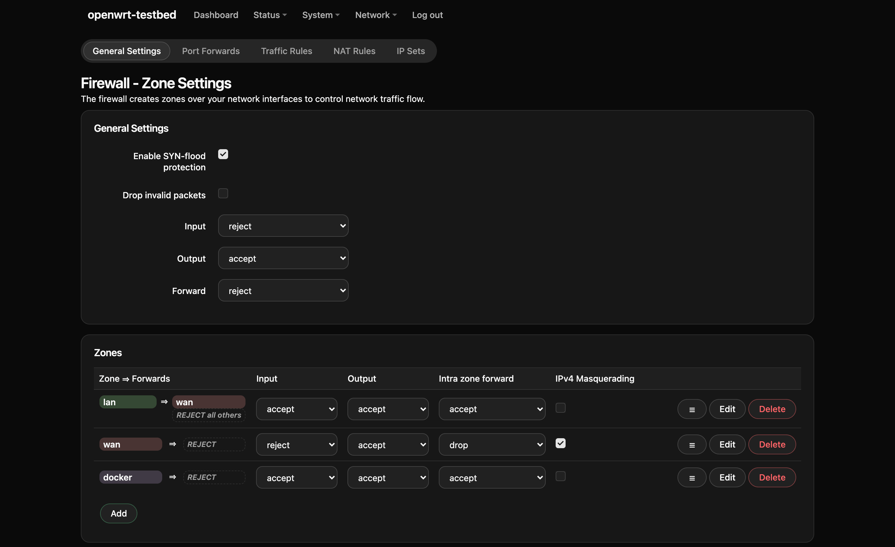

# Screenshots

All taken on the test bench — OpenWrt 25.12.4 with the full LuCI, `npm run bench`
away from anybody who wants to look at the theme without installing it. The
palette is shadcn **neutral**; swapping `theme/globals.css` recolours every one
of these.

## Dark

### Firewall — zones

Tabs, cards, both checkbox states, native selects, the coloured zone badges LuCI
paints inline, a table, and all three button kinds at once.

### Network — interfaces

### Dashboard

### Unsaved changes

The uci diff LuCI shows before applying, in a modal.

### Login

The shadcn login block: a card on a muted canvas, labels above the fields.

## Light

### System — settings

## On a phone

The device name takes its own centred row, the menu wraps under it, and the tab
strip becomes a rectangular card — a pill strip that wraps onto three lines is a
blob. Option rows stack, labels above fields.

  

