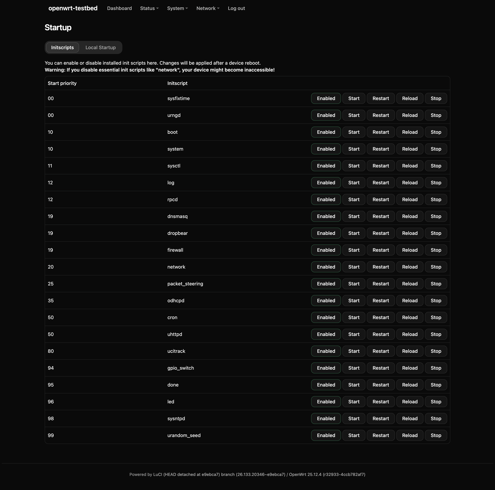
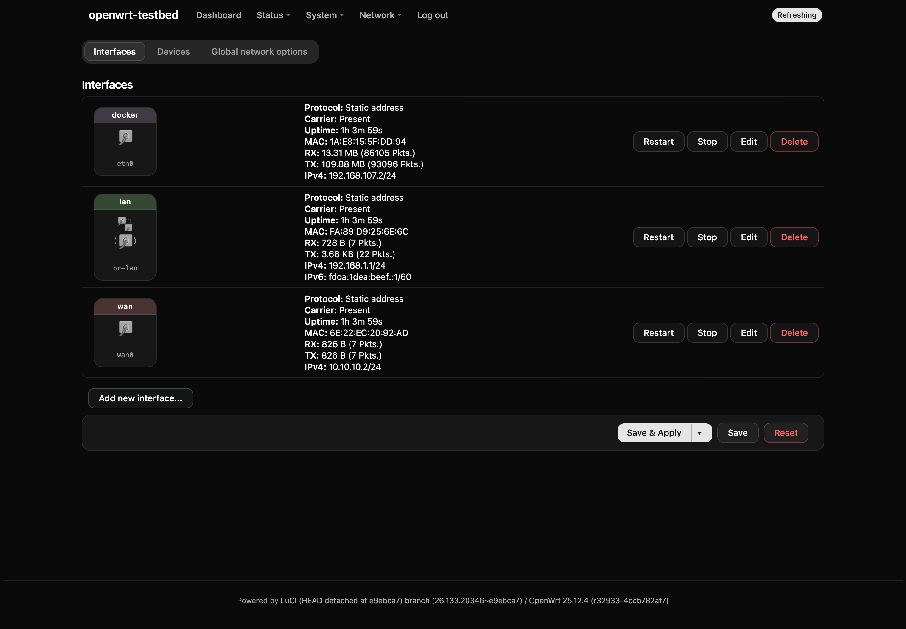
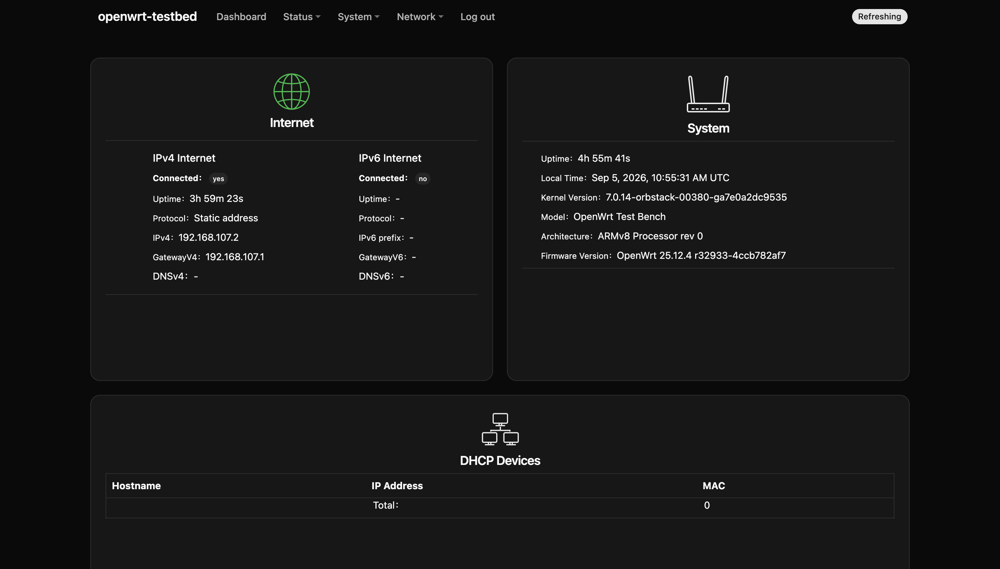
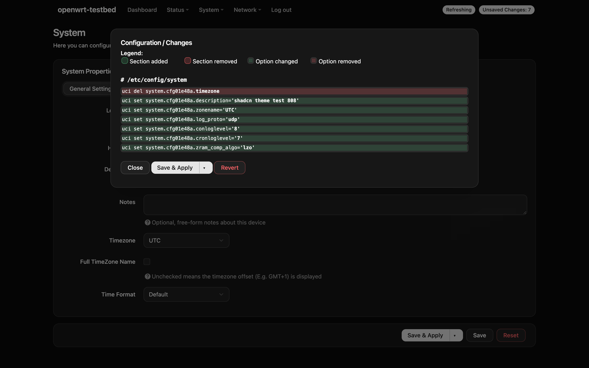
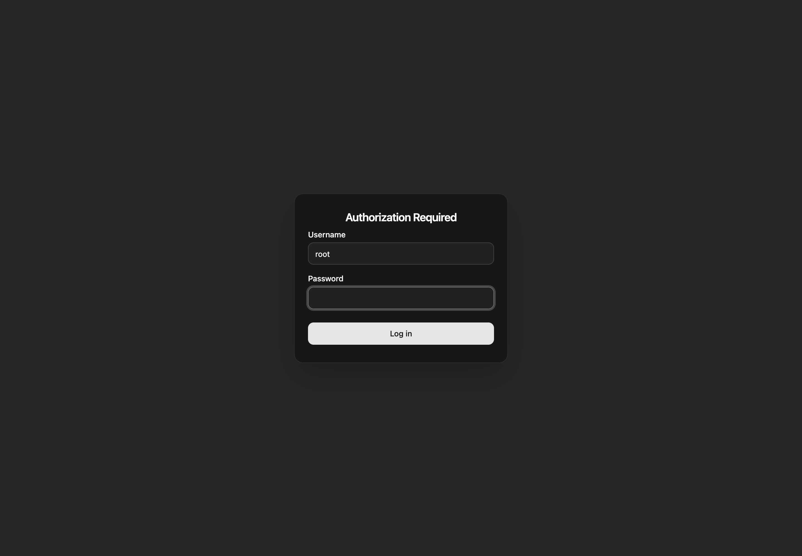
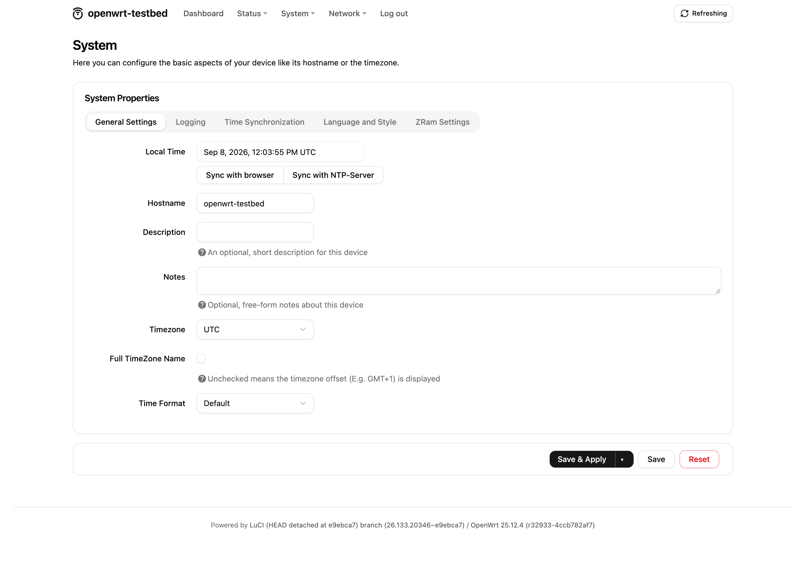
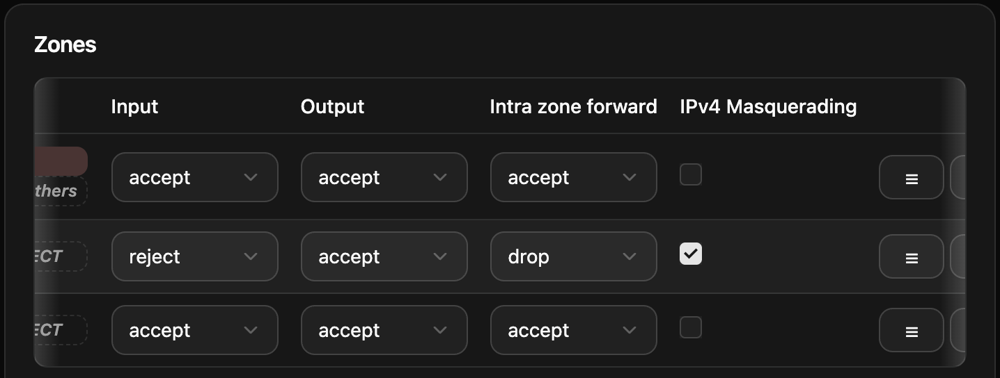
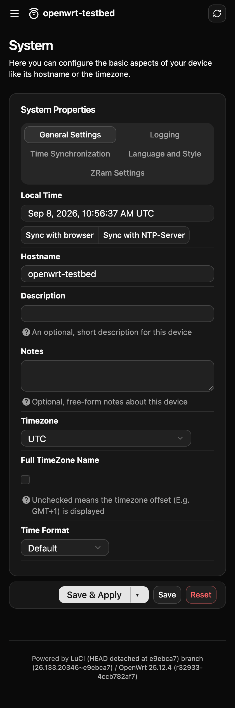
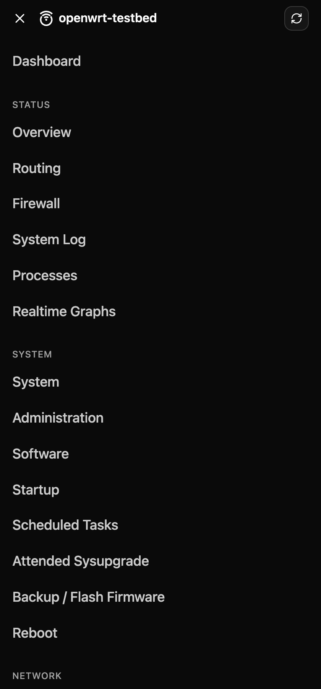

# Screenshots

All taken on the test bench — OpenWrt 25.12.4 with the full LuCI, `npm run bench`
away from anybody who wants to look at the theme without installing it. The
palette is shadcn **neutral**; swapping `theme/globals.css` recolours every one
of these.

The firewall page is the one on the README's front page, dark and light joined
along a diagonal — tabs, cards, both checkbox states, native selects, the
coloured zone badges LuCI paints inline, a table and all three button kinds in a
single screen.

## Dark

### System — startup

A long table with a row of buttons on every line.

### Network — interfaces

### Dashboard

### Unsaved changes

The uci diff LuCI shows before applying, in a modal.

### Login

The shadcn login block: a card on a muted canvas, labels above the fields.

## Light

### System — settings

## Wide tables

A table that does not fit scrolls inside itself instead of pushing the page
sideways, and shades the edge it can still be pulled from. Here it is scrolled to
the middle, so both edges are marked; at either end that side's shade is gone,
and a table that fits shows neither.

The frame stays put while the content slides under it, which is why the frame
lives on the scroll box rather than on the table.

## On a phone

The header is one row — burger, the OpenWrt mark, the device name, the poll
button. The tab strip spans the full width with the tabs laid out as a grid: a
strip that wraps onto three lines is a blob. Option rows stack, labels above
fields.

  

### The menu

The whole menu opens as a sheet over the page: the top level becomes a group
label in small caps, its children the rows under it, and the page behind stays
put while the sheet scrolls.

No script drives it. `header.ut` puts a checkbox in front of the `<ul>` LuCI
fills at runtime, and everything below is that checkbox's `:checked` state —
which is also why the sheet is a child of `<header>`, and why the bar's contents
are lifted above it so the same control closes it.

  

